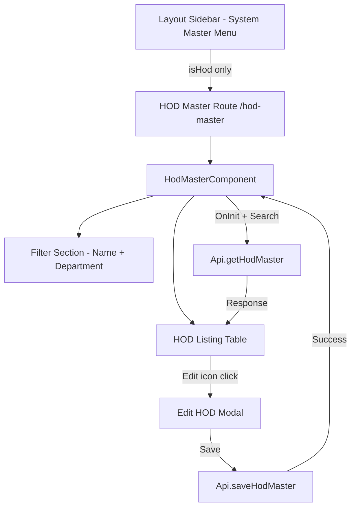
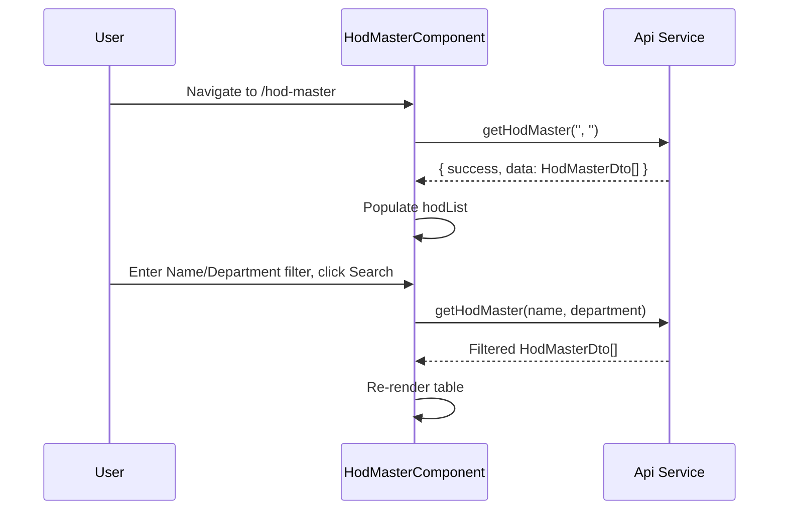
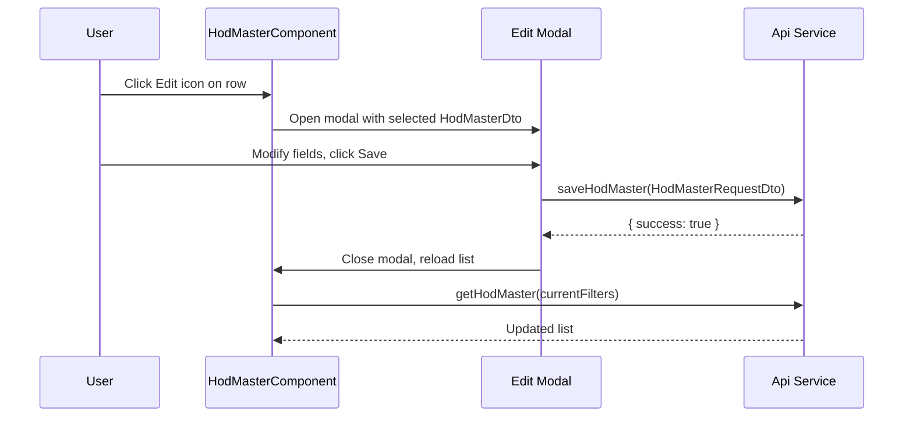

# Design Document: HOD Master

## Overview

The HOD Master feature adds a new screen under the System Master menu that allows HOD-role users to view and edit the list of Heads of Department (HODs). The screen provides a filterable table listing all HODs, with an inline Edit action that opens a modal for updating HOD details via the `saveHodMaster` API.

The feature is role-restricted: only users with `isHOD === 'H'` can see the menu item and access the screen.

---

## Architecture



---

## Sequence Diagrams

### Load & Filter Flow



### Edit & Save Flow



---

## Components and Interfaces

### HodMasterComponent

**Purpose**: Main page component hosting the filter section, HOD table, and edit modal.

**Selector**: `app-hod-master`

**Interface**:
```typescript
class HodMasterComponent implements OnInit {
  hodList: HodMasterDto[];
  filterName: string;
  filterDepartment: string;
  isLoading: boolean;
  showEditModal: boolean;
  selectedHod: HodMasterDto | null;
  isSaving: boolean;

  ngOnInit(): void;
  loadHodList(): void;
  onSearch(): void;
  openEditModal(hod: HodMasterDto): void;
  closeEditModal(): void;
  onSave(): void;
}
```

**Responsibilities**:
- Fetch HOD list on init and on search
- Manage filter state (name, department)
- Control edit modal visibility and selected HOD data
- Call `saveHodMaster` and refresh list on success

---

## Data Models

### HodMasterDto (existing in common.model.ts)

```typescript
interface HodMasterDto {
  id: number;
  empId: string;
  employeeName: string;
  department: string;
  designation: string;
  isActive: string;   // 'Y' or 'N'
  isCed: string;
  psDeptMasterId: string | null;
  psProfMasterId: string | null;
}
```

### HodMasterRequestDto (existing in common.model.ts)

```typescript
interface HodMasterRequestDto {
  id?: number;
  empId: string;
  employeeName: string;
  department: string;
  designation: string;
  isActive: string;
  createdBy: string;
}
```

**Validation Rules**:
- `employeeName` must be non-empty
- `department` must be non-empty
- `isActive` must be `'Y'` or `'N'`
- `createdBy` is populated from `localStorage.current_user.empId`

---

## UI Layout

### Filter Section

```
┌─────────────────────────────────────────────────────────┐
│  [Name Input]          [Department Input]               │
│                                                         │
│                    [Search Button]                      │
└─────────────────────────────────────────────────────────┘
```

### HOD Listing Table

```
┌──────┬──────────────────────┬────────────┬─────────────────────┬──────────┬─────────┐
│  #   │  Employee Name       │  Emp ID    │  Department         │  Status  │ Actions │
├──────┼──────────────────────┼────────────┼─────────────────────┼──────────┼─────────┤
│  1   │  ABDUL RASHEED RIYAS │  ADS3075   │  OPERATIONS         │  Active  │  ✏️     │
│  2   │  AJITH KUMAR         │  ADS3003   │  PURCHASE           │  Active  │  ✏️     │
└──────┴──────────────────────┴────────────┴─────────────────────┴──────────┴─────────┘
```

### Edit Modal

```
┌──────────────────────────────────────────────┐
│  [Icon] Edit HOD                         [X] │
├──────────────────────────────────────────────┤
│  Employee Name  [readonly input]             │
│  Emp ID         [readonly input]             │
│  Department     [readonly input]             │
│  Designation    [readonly input]             │
│  Is Active      [Y / N toggle/select]        │
├──────────────────────────────────────────────┤
│  [Cancel]                        [Save]      │
└──────────────────────────────────────────────┘
```

Fields like `employeeName`, `empId`, `department`, and `designation` are read-only in the modal (display only). Only `isActive` is editable, matching the intent of the save API.

---

## Menu Integration

In `layout.html`, the System Master submenu already exists and is visible to `isHod || isCed`. The HOD Master menu item is added **only for HOD role** (`isHod`):

```html
<!-- Inside System Master submenu -->
<a *ngIf="isHod" routerLink="/hod-master" routerLinkActive="active" (click)="closeSidebarOnMobile()">
  <i class="fas fa-user-tie"></i>
  <span>HOD Master</span>
</a>
```

The `isSystemMasterRouteActive()` method in `layout.ts` must also include `/hod-master` to auto-open the submenu.

---

## Routing

New route added to `app.routes.ts` under the authenticated layout children:

```typescript
{ path: 'hod-master', component: HodMasterComponent }
```

---

## Error Handling

| Scenario | Handling |
|---|---|
| API fetch fails | Show error toast, keep table empty with "No data" message |
| Save API fails | Show error toast, keep modal open |
| Save API succeeds | Show success toast, close modal, reload list |
| Empty filter search | Fetch all records (pass empty strings) |

---

## Correctness Properties

*A property is a characteristic or behavior that should hold true across all valid executions of a system — essentially, a formal statement about what the system should do. Properties serve as the bridge between human-readable specifications and machine-verifiable correctness guarantees.*

### Property 1: Filter parameters are forwarded to the API

*For any* combination of name and department filter strings (including empty strings), calling `onSearch()` or `loadHodList()` should result in `getHodMaster` being called with exactly those string values.

**Validates: Requirements 1.1, 1.2, 1.5**

### Property 2: Table row count matches API response

*For any* list of `HodMasterDto` objects returned by `getHodMaster`, the number of rendered table rows should equal the length of that list.

**Validates: Requirements 1.3**

### Property 3: Edit modal opens with matching HOD data

*For any* `HodMasterDto` in `hodList`, calling `openEditModal(hod)` should set `selectedHod` to that exact object and set `showEditModal` to `true`.

**Validates: Requirements 2.1**

### Property 4: Save request maps selectedHod fields correctly

*For any* `selectedHod` value, calling `onSave()` should invoke `saveHodMaster` with a `HodMasterRequestDto` whose `id`, `empId`, `employeeName`, `department`, and `designation` fields match the corresponding fields of `selectedHod`.

**Validates: Requirements 2.4**

### Property 5: createdBy is always sourced from the session

*For any* save operation, the `createdBy` field of the submitted `HodMasterRequestDto` should equal `localStorage.current_user.empId`, regardless of any other component state.

**Validates: Requirements 3.1**

### Property 6: isActive is always 'Y' or 'N'

*For any* save operation, the `isActive` field of the submitted `HodMasterRequestDto` should be exactly `'Y'` or `'N'` — no other value is permitted.

**Validates: Requirements 3.2**

### Property 7: HOD Master menu item visibility matches role

*For any* authenticated session, the HOD Master menu item should be visible if and only if `isHOD === 'H'`; for all other `isHOD` values (`'E'`, `'C'`, or absent) the item should not be rendered.

**Validates: Requirements 4.1, 4.2**

---

## Testing Strategy

### Unit Testing Approach

- Test `onSearch()` calls `getHodMaster` with correct filter params
- Test `openEditModal()` sets `selectedHod` and `showEditModal = true`
- Test `onSave()` maps `HodMasterDto` → `HodMasterRequestDto` correctly
- Test `closeEditModal()` resets state

### Property-Based Testing Approach

**Property Test Library**: jasmine / karma (existing Angular test setup)

- Property 1: generate random name/department strings, verify API call params match
- Property 2: generate random-length `HodMasterDto` arrays, verify row count equals array length
- Property 3: generate random `HodMasterDto`, verify modal state after `openEditModal`
- Property 4: generate random `HodMasterDto`, verify `saveHodMaster` payload fields
- Property 5: generate random session `empId` values, verify `createdBy` in every save payload
- Property 6: verify `isActive` in every save payload is `'Y'` or `'N'`
- Property 7: generate all `isHOD` values, verify menu item visibility

### Integration Testing Approach

- Verify filter inputs bound to `filterName` / `filterDepartment` trigger correct API params
- Verify modal save triggers list reload
- Verify unauthenticated access to `/hod-master` redirects to login (Requirement 3.3)
- Verify System Master submenu auto-opens when route is `/hod-master` (Requirement 4.3)

---

## Security Considerations

- Route is protected by `AuthGuard` (inherited from parent layout route)
- Menu item visibility is controlled by `isHod` role flag derived from `localStorage.current_user.isHOD`
- `createdBy` is always sourced from the authenticated session, never from user input

---

## Dependencies

- `Api` service — `getHodMaster()` and `saveHodMaster()` (already implemented)
- `HodMasterDto` and `HodMasterRequestDto` models (already in `common.model.ts`)
- `FormsModule` — for `[(ngModel)]` bindings
- `CommonModule` — for `*ngIf`, `*ngFor`
- `ToastrService` — for success/error notifications
- FontAwesome icons (`fa-user-tie`, `fa-pencil-alt`, `fa-search`)
- Existing app CSS variables (`--primary-green`, `--primary-dark`, etc.)
